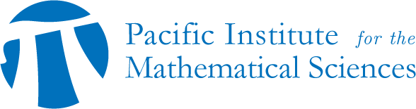

# GAP 2023 — Homotopy Algebras and Higher Structures

May 22-26, 2023 @ [Institut Henri Poincaré](https://www.ihp.fr) in Paris

+ on-site: [11 Rue Pierre et Marie Curie, 75005 Paris](https://goo.gl/maps/wDzP5XtWjtxT2y896)

+ online: [livestream](https://www.ihp.fr/en/live)

This conference is part of the [thematic trimester 'Higher Structures in Geometry and Mathematical Physics'](https://indico.math.cnrs.fr/category/569/).

## SCHEDULE {#top}

|     |       |        |
|:----|:-----:|-------:|
| MON | 09:30 | registration |
|     | 10:00 | _welcome coffee_ |
|     | 10:30 | [Bernhard Keller](#keller) |
|     | 11:30 | [Domenico Fiorenza](#fiorenza) |
|     | 12:30 | _lunch break_ |
|     | 14:15 | [Leonid Positselski](#positselski) |
|     | 15:15 | [Dominique Mouhanna](#mouhanna) |
|     | 15:30 | _coffee break_ |
|     | 16:00 | [Wendy Lowen](#lowen) |
|     | 17:00 | poster session |
|     | 18:00 | [reception](#reception) |
| TUE | 09:00 | [Martin Markl](#markl) |
|     | 10:00 | _coffee break_ |
|     | 10:30 | [Julien Grivaux](#grivaux) |
|     | 11:30 | [Shahn Majid](#majid) |
|     | 12:30 |_lunch break_ |
|     | 14:00 | [Kirsten Wickelgren](#wickelgren) |
|     | 15:00 | _coffee break_ |
|     | 15:30 | [Adrian Ocneanu](#ocneanu) |
|     | 16:30 | |
| WED | 09:00 | [Benoit Dhérin](#dherin) |
|     | 10:00 | _coffee break_ |
|     | 10:30 | [Olivier Schiffmann](#schiffmann) |
|     | 11:30 | [Thomas Willwacher](#willwacher) |
|     | 12:30 | |
| THU | 09:00 | [Muriel Livernet](#livernet) |
|     | 10:00 | _coffee break_ |
|     | 10:30 | [Alexander Berglund](#berglund) |
|     | 11:30 | [Christoph Schweigert](#schweigert) |
|     | 12:30 |_lunch break_ |
|     | 14:00 | [Mikhail Kapranov](#kapranov) |
|     | 15:00 | _coffee break_ |
|     | 15:30 | [Pavel Mnev](#mnev) |
|     | 16:30 | |
| FRI | 09:00 | [Ralph Kaufmann](#kaufmann) |
|     | 10:00 | _coffee break_ |
|     | 10:30 | [Yuri Berest](#berest) |
|     | 11:30 | |

<!---

|     | 11:30 | [Marco Manetti](#manetti) |
|     | 12:30 | |

--->

<!---

||MONDAY|TUESDAY|WEDNESDAY|THURSDAY|FRIDAY|
|:--:|:--:|:--:|:--:|:--:|:--:|
|09:00|welcome|Keller|Hua|Keller|Keller|
|10:00|_break_|_break_|_break_|_break_|_break_|
|10:30|Fantechi|Rouquier|Getzler|Rouquier|Bandiera|
|11:30|Laurent|Bergner|TBA|Getzler|Getzler|
|12:30|_lunch_|_lunch_|_lunch_|_lunch_|_lunch_|
|14:00|Williams|Manetti| |Fresse||
|15:00|_break_|_break_| |_break_||
|15:30|Rouquier|Toda| |Rivera||
|16:30||||||
|||_dinner_||||

[Getzler](#getzler)

[Keller](#keller)

[Rouquier](#rouquier)

[Bandiera](#bandiera)

[Bergner](#bergner)

[Fantechi](#fantechi)

[Fresse](#fresse)

[Hua](#hua)

[Laurent-Gengoux](#laurent-gengoux)

[Manetti](#manetti)

[Rivera](#rivera)

[Toda](#toda)

[Williams](#williams)

||MONDAY|TUESDAY|WEDNESDAY|THURSDAY|FRIDAY|
|:--:|:--:|:--:|:--:|:--:|:--:|
|09:00|09:45 welcome|[Keller](#keller)|[Hua](#hua)|[Keller](#keller)|[Keller](#keller)|
|10:00|_break_|_break_|_break_|_break_|_break_|
|10:30|[Fantechi](#fantechi)|[Rouquier](#rouquier)|[Getzler](#getzler)|[Rouquier](#rouquier)|[Bandiera](#bandiera)|
|11:30|[Laurent](#laurent-gengoux)|[Bergner](#bergner)|11:30 [Seol](#seol), 12:00 [Pietromonaco](#pietromonaco)|[Getzler](#getzler)|[Getzler](#getzler)|
|12:30|_lunch_|_lunch_|_lunch_|_lunch_|_lunch_|
|14:00|[Williams](#williams)|[Manetti](#manetti)|[Fresse](#fresse)|_Stanley_||
|15:00|_break_|_break_|_break_|_Park_||
|15:30|[Rouquier](#rouquier)|[Toda](#toda)|[Rivera](#rivera)|_walk_||
|16:30||poster session||||
|||_dinner_||||

--->

## ABSTRACTS

---

### Dominique Mouhanna, Deputy Director of IHP {#mouhanna}

**Welcome Address**

[back to top](#top)

---

### Reception {#reception}

**Apéritif de bienvenue**

Refreshments will be provided.

[back to top](#top)

---

### Alexander Berglund _(Stockholm University)_ {#berglund}

**Higher structures in automorphisms of manifolds**

In previous work, Ib Madsen and I discovered some remarkable higher structure, governed by Kontsevich's Lie graph complex, in the rational cohomology of automorphism groups of certain high dimensional manifolds, specifically the "generalized surfaces" $\#^g(S^d \times S^d)$ for $d > 1$. In this talk, I will report on some recent developments prompted by this discovery. In particular, I will present new structural results for spaces of self-homotopy equivalences of arbitrary simply connected Poincaré duality spaces that lead to a more conceptual explanation of this higher structure.

[back to top](#top)

---

### Yuri Berest _(Cornell University)_ {#berest}

**Spaces of quasi-invariants and homotopy Lie groups**

Quasi-invariants are natural geometric generalizations of invariant polynomials of finite reflection groups. They first appeared in mathematical physics in the early 1990s, and since then have found applications in many other areas: most notably, representation theory, algebraic geometry and combinatorics. In this talk, I will explain how the algebras of quasi-invariants can be realized topologically as (equivariant) cohomology rings of certain spaces naturally attached to compact connected Lie groups. Our main result is a generalization of a well-known theorem of A. Borel that realizes the algebra of invariant polynomials of a Weyl group W as the cohomology ring of the classifying space BG of the corresponding Lie group G. Replacing equivariant cohomology with equivariant K-theory (resp., elliptic cohomology) gives multiplicative (resp., elliptic) analogues of quasi-invariants. But perhaps most interesting is the fact that the spaces of quasi-invariants can be also defined for non-Coxeter (p-adic) pseudo-reflection groups, in which case the compact Lie groups are replaced by p-compact groups -- remarkable homotopy-theoretic objects a.k.a. homotopy Lie groups. Time permitting, I will also discuss some applications in the context of stable homotopy theory. (Based on joint work with A. C. Ramadoss.)

[back to top](#top)

---

### Benoit Dhérin _(Google)_ {#dherin}

**Symplectic microgeometry and quantization**

In this talk, we will introduce introduce the notion of symplectic micromorphisms. First, we will explain how various natural examples such as flows and symmetries in classical mechanics or Poisson structures in geometry can be expressed as special symplectic micromorphisms. Second, we will describe how Fourier integral operators can be used to quantize symplectic micromorphisms yielding quantum counterparts of these structures. (The ideas in this talk are based on works in collaboration with Alan Weinstein, Alberto Cattaneo, Igor Mencattini, and Friedrich Wagemann.)

[back to top](#top)

---

### Ralph Kaufmann _(Purdue University)_ {#kaufmann}

**Higher operations from algebra and geometry**

Higher operations appear in the context of up to homotopy equations. For instance the pre-Lie product is a homotopy for the commutator.
Such higher operations are often associated with a graphical or geometric calculus. In new work with Rivera and Wang, we find a natural Poisson double bracket as such a homotopy, which is a member of a series of even higher brackets. Interestingly the odd brackets vanish in a directed setting, but can be defined in an undirected setting. The double bracket yields a homotopy for a four term relation involving a product, a coproduct and their opposites. It dualizes to an $m_3$ multiplicaton which is part of an $A_\infty$ structure with all $m_i > 4$ vanishing. Such structures were also studied in a different context by N. Iyudu, M. Kontsevich, and Y. Vlassopoulos.

[back to top](#top)

---

### Mikhail Kapranov _(Kavli IPMU)_ {#kapranov}

**Categorification of Euler's continuants, N-spherical functors and periodic semi-orthogonal decompositions**

Euler continuants are universal polynomials expressing the numerator
and denominator of a finite continued fraction whose entries are independent
variable. Remarkably, they allow categorical lifts which are certain complexes
constructed out of a functor and its iterated adjoints. The totalizations of these
complexes can be seen as higher analogs of spherical twists and cotwists
and lead to a generalization of spherical functors which we call N-spherical.
They describe periodic semi-orthogonal decompositions (SODs) of triangulated
(or, rather stable infinity-) categories. In fact, forming iterated mutations of an SOD can be seen as a categorical lift of forming a continued fraction. Joint work
with T. Dyckerhoff, V. Schechtman.

[back to top](#top)

---

### Domenico Fiorenza _(Sapienza Università di Roma)_ {#fiorenza}

**String bordism invariants in dimension 3 from $U(1)$-valued TQFTs**

The third string bordism group is known to be $\mathbb{Z}/24\mathbb{Z}$. Using Waldorf's notion of a geometric string structure on a manifold, Bunke--Naumann and Redden have exhibited integral formulas involving the Chern-Weil form representative of the first Pontryagin class and the canonical 3-form of a geometric string structure that realize the isomorphism $Bord_3^{String} \to \mathbb{Z}/24\mathbb{Z}$ (these formulas have been recently rediscovered by Gaiotto--Johnson-Freyd--Witten). In the talk I will show how these formulas naturally emerge when one considers the U(1)-valued 3d TQFTs associated with the classifying stacks of Spin bundles with connection and of String bundles with geometric structure. Joint work with Eugenio Landi ([arXiv:2209.12933](https://arxiv.org/abs/2209.12933)).

[back to top](#top)

---

### Julien Grivaux _(Sorbonne Université)_ {#grivaux}

**Algebraic structures attached to a closed embedding**

This talk will be devoted to some geometrical constructions attached to a closed embedding of complex manifolds. A concrete way to measure the complexity of such an embedding is to understand how geometric objects, like vector bundles or coherent sheaves, can extend (at least formally). This deformation problem is controlled at the first order by a cohomology class that can be made explicit. Later on, Arinkin and Caldararu provided a link between these constructions and the theory of derived intersections. In this talk, we will present a second order condition, called moderation, that allows to provide an explicit description of the Ext algebra attached to a closed embedding. This is joint work with Damien Calaque.

[back to top](#top)

---

### Bernhard Keller _(Université Paris Cité)_ {#keller}

**Singularity categories, Leavitt path algebras and Hochschild homology**

The singularity category of a noetherian (non commutative)
algebra is the quotient of its bounded by its perfect derived category. This construction goes back to
Buchweitz (1986) in this setting and, independently, to Orlov (2003) in a geometric
setting. We will recall the description of the singularity category of a radical-square
zero quiver algebra using a graded Leavitt path algebra following work of Paul
Smith, Xiao-Wu Chen, Dong Yang and others. We will then combine this with a localization
theorem for Hochschild homology to obtain a simple description of the Hochschild homology of these
singularity categories (with their canonical differential graded
enhancement) and of the corresponding Leavitt path algebras. Finally, we will report on
recent work of Xiao-Wu Chen and Zhengfang Wang which yields a generalization from
radical-square zero to arbitrary finite-dimensional algebras (over an algebraically
closed field).
This is mainly a survey talk. The original parts are based on joint work
with Umamaheswaran Arunachalam and Yu Wang.

[back to top](#top)

---

### Muriel Livernet _(Université Paris Cité)_ {#livernet}

**Homotopy theory of spectral sequences**

Spectral sequences arise as algebraic tools in many areas of mathematics. Of particular interest are spectral sequences of filtered complexes and multicomplexes. Questions addressed during the talk: how to compare spectral sequences? Can we invert some class of weak equivalences, as e.g. morphisms realizing an isomorphism from a given page and afterwards? This is a long project with S. Whitehouse and I will explain some model category structures relying on these weak equivalences, for filtered complexes, multicomplexes and show that for spectral sequences we have a weaker notion of model category structure.

[back to top](#top)

---

### Wendy Lowen _(Universiteit Antwerpen)_ {#lowen}

**Higher structures and deformations of non-commutative spaces**

In deformation theory, higher structure naturally occurs on two different levels. Firstly, it occurs on the complexes governing deformations: according to Deligne's principle, these should at least be DG Lie or $L_\infty$ algebras.

Secondly, higher structure can occur when modeling deformed objects: these may be more complicated than the original objects in case the deformation complex encodes additional structure. 

Taking Gerstenhaber's deformation theory of algebras, governed by the Hochschild complex, as the starting point, we will discuss the occurrence of higher structure when deforming schemes into "non-commutative spaces". We will look into two algebraic models for spaces: DG categories and prestacks. For the latter, we will present an operadic structure on the Gerstenhaber--Schack complex recently established in joint work with Hoang Dinh Van and Lander Hermans. This yields an underlying $L_\infty$ structure governing deformations of prestacks.

[back to top](#top)

---

### Shahn Majid _(Queen Mary University of London)_ {#majid}

**Braided bimodules, quantum jet bundles and quantum geodesics**

We show how solutions of the Yang-Baxter or braid relations on bimodules over a possibly noncommutative algebra arise naturally in the context of bimodule connections in noncommutative geometry. As an application, we show how such connections can be used to define a notion of quantum jet bundle in work with F. Simao. We also show in work with E. Beggs how the same idea applied to A-B bimodule connections lead to a notion of quantum geodesics on A with parameter space algebra B and are already present for A the Heisenberg algebra in quantum mechanics.

[back to top](#top)

---

<!---
### Marco Manetti _(Sapienza Università di Roma)_ {#manetti}

**Semiregularity maps and deformations of modules over Lie algebroids**

Let $A\subset L$ be a flat inclusion of Lie algebroids, i.e., a Lie pair, on a smooth  separated scheme over a field of characteristic $0$. For every locally free $A$-module $M$ we define its semiregularity maps and prove that, under some additional assumptions, they annihilate obstructions to deformations of $M$. In case $A=0$ and $L=\text{tangent bundle}$, this construction gives to the usual Buchweitz-Flenner's semiregularity maps for coherent sheaves.

[back to top](#top)

---

--->

### Martin Markl _(Czech Academy of Sciences, Prague)_ {#markl}

**Operads and the blob complex (joint work with M. Batanin)**

I will show that the Morrison-Walker blob complex appearing in
Topological Quantum Field Theory is an operadic bar resolution of a
certain operad composed of fields and local relations. My talk will be
based on the draft "Operads, operadic categories and the blob complex" available [here](https://users.math.cas.cz/~markl/).

[back to top](#top)

---

### Pavel Mnev _(University of Notre Dame)_ {#mnev}

**On the Fukaya-Morse A-infinity category**

I will explain the construction of the Fukaya-Morse category of a Riemannian manifold $X$ --- an A-infinity category where the higher composition maps are given in terms of numbers of embedded trees in $X$, with edges following the gradient trajectories of certain Morse functions. I will give simple examples and explain different approaches to understanding the structure and proving the quadratic relations on the structure maps -- (1) via homotopy transfer, (2) effective field theory ("second quantization") approach, (3) topological quantum mechanics ("first quantization") approach. The talk is based on a joint work with O. Chekeres, A. Losev and D. Youmans. [arXiv:2112.12756](https://arxiv.org/abs/2112.12756)

[back to top](#top)

---

### Adrian Ocneanu _(Pennsylvania State University)_ {#ocneanu}

**Representation Theory as Curvature and QFT**

We show that matrix representations and their intertwiners are naturally described in terms of Gaussian and Riemannian curvature.
The computation of intertwiner coefficients and the decomposition of Young tableaux or Gelfand Tsetlyn patterns, as tensor product of forms are done by QFT type propagation formulae.
That brings together matter, with inner symmetry described by representation theory, and gravity, as discretized curvature.
We describe a stronger analog of the Weyl character formula, which has a similar form, but generates all the representation vectors, rather than only their weights.

[back to top](#top)

---

### Leonid Positselski _(Czech Academy of Sciences, Prague)_ {#positselski}

**The homomorphism removal and repackaging construction**

This work is an attempt to understand the maximal natural
generality context for the Koenig-Kuelshammer-Ovsienko construction
in the theory of quasi-hereditary algebras by putting it into
a category-theoretic context. Given a field $k$ and a $k$-linear exact
category $E$ with a chosen set of nonzero objects $F_i$ such that every
object of $E$ is a finitely iterated extension of some $F_i$, we construct
a coalgebra $C$ whose irreducible comodules $L_i$ are indexed by the same
indexing set, and an exact functor from $C-\mathrm{comod}$ to $E$ taking $L_i$ to $F_i$
such that the spaces $\mathrm{Ext}^n$ between $L_i$ in $C-\mathrm{comod}$ are the same as
between $F_i$ in $E$ (for $n > 0$). Thus the abelian category $C-\mathrm{comod}$ is
obtained from the exact category $E$ by removing all the nontrivial
homomorphisms between the chosen objects $F_i$ in $E$ while keeping
the $\mathrm{Ext}$ spaces unchanged. The removed homomorphisms are then
repackaged into a semialgebra $S$ over $C$ such that the exact category E
can be recovered as the category of $S$-semimodules induced from
finite-dimensional $C$-comodules. The construction used Koszul duality
twice: one as absolute and once as relative Koszul duality.

[back to top](#top)

---

### Olivier Schiffmann _(Université Paris-Saclay)_ {#schiffmann}

**Cohomological Hall algebras associated to curves in surfaces**

We will discuss some ongoing project with Diaconescu, Porta, Sala and Vasserot in which we study the convolution algebra of cohomological correspondences acting on moduli spaces of sheaves on surfaces via modifications along 1-dim subschemes.
We obtain some relation to affine Yangians.

[back to top](#top)

---

### Christoph Schweigert _(Universität Hamburg)_ {#schweigert}

**String-net methods for CFT correlators**

Based on a graphical calculus for pivotal bicategories, we develop a
string-net construction of a modular functor. We show that a rigid
separable Frobenius functor between strictly pivotal bicategories
induces a linear map between the corresponding bicategorical string-net
spaces that is compatible with the mapping class group actions and with
sewing. This result implies that correlators of two-dimensional
conformal field theories factorize over string-net spaces constructed
from defect data.

[back to top](#top)

---

### Kirsten Wickelgren _(Duke University)_ {#wickelgren}

**A quadratically enriched zeta function**

For a smooth variety over a finite field, we enrich the logarithmic derivative of the zeta function to a power series with coefficients in the Grothendieck--Witt group of stable isomorphism classes of unimodular modular forms, using traces of powers of Frobenius in A1-homotopy theory. (It is not a motivic measure applied to Professor Kapranov's.) In analogy with the celebrated connection between the Betti numbers of associated complex manifolds, we show the quadratically enriched logarithmic zeta function to be connected to the Betti numbers of the associated real manifolds. We show a Lefshetz fixed point theorem for cellular varieties with a recent cohomology theory of F. Morel and A. Sawant, proving a rationality result for cellular varieties. This is joint work with Margaret Bilu, Wei Ho, Padma Srinivasan, and Isabel Vogt. [arXiv:2210.03035](https://arxiv.org/abs/2210.03035)

[back to top](#top)

---

### Thomas Willwacher _(ETH Zürich)_ {#willwacher}

**Graph complexes and moduli spaces of curves**

I discuss graph complexes that compute the weight 2 and weight 11 part of the compactly supported cohomology of the moduli spaces of curves. They give rise to many new classes in that cohomology and establish links to knot theory, where similar graph complexes occur.

The talk is based on recent joint work with Sam Payne.

[back to top](#top)

---

<!---

--->

